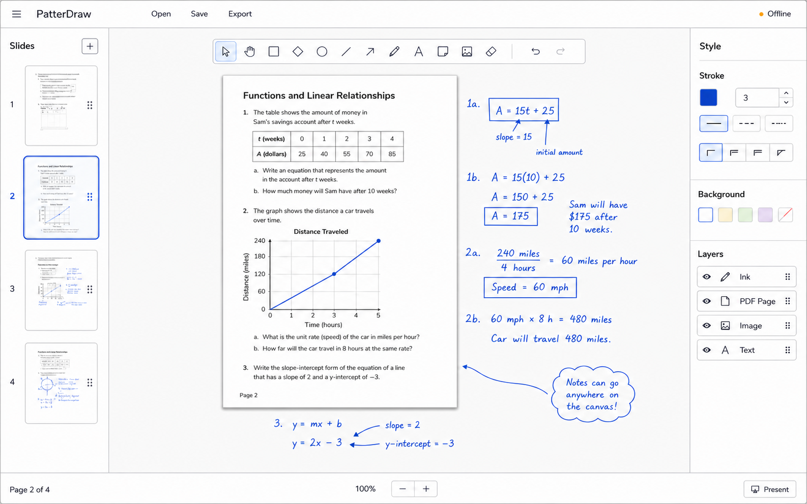

# PatterDraw

PatterDraw is a separate, offline-first classroom whiteboard built on the official Excalidraw component. It opens as a full-width board, removes hosted collaboration and web-content surfaces, and lets the teacher turn slide controls on only when they are needed. Imported PDF pages become locked backgrounds with writable infinite space around them.

PatterDraw is an independent project and is not affiliated with, endorsed by, or maintained by Excalidraw.

This repository is intentionally independent from PolyPad. Nothing here patches `PolyPadV38` or `mod_polypad`.



## Current vertical slice

- Locally bundled `@excalidraw/excalidraw@0.18.1` with collaboration, AI, embeds, external canvas links, public-library routing, telemetry, and remote runtime assets excluded or blocked.
- Board-first workspace with an accessible **Slides** toggle. The live editor stays mounted, so switching modes does not discard selections, history, or canvas position.
- **Clear board** in Board mode starts a fresh main canvas after confirmation and a required local recovery copy. Clearing includes off-screen and locked objects; slides require an extra acknowledgement. PDFs and the personal library stay untouched. Use **Undo** before leaving the board, or **Settings → Recovery history** after navigating/reloading. If recovery storage fails, nothing is cleared.
- Offline LaTeX equations rendered to movable Excalidraw image elements by a locally bundled MathJax 4.1.3. Select an equation and press **Equation** to edit its original LaTeX.
- Offline, no-AI Mermaid diagrams with explicit **Preview** and **Insert** actions. Flowchart, sequence, class, ER, and state diagrams become editable Excalidraw objects and can be reopened from a selected diagram.
- Default-off experimental **3D GeoGon** tool workspace, bundled and integrity-pinned locally. Enable experimental Math Tools, build in the controlled dialog, then choose **Insert into PatterDraw** to add a sanitized vector image. Copy/paste and dropped GeoGon PNG/SVG files remain supported. Inserted views are ordinary local images included in autosave and `.patterdraw` backups; live board embeds remain disabled.
- Browser autosave plus portable `.patterdraw` project files containing scene data and original PDF bytes. Existing `.canvasclassroom` files remain supported for import.
- One-click **Export all** downloads every object on the current board as a shareable PNG, including off-screen and off-page content. Editable Excalidraw scene data is embedded when the receiving image workflow preserves PNG metadata.
- A device-wide, locally persisted Excalidraw library supports adding and reusing canvas objects plus importing and exporting standard `.excalidrawlib` files without enabling public-library browsing or publishing.
- A separate device-wide **Screenshot Library** captures exact canvas regions, copies PNGs when browser clipboard access permits, and keeps the newest 50 captures available for click or drag insertion without adding them to project files.
- **Canvas capture for OBS** adds a clean crop target to the current live canvas without a popup or synchronized renderer. Board and Slides can use either a 16:9 guide or all visible canvas, PDF uses the full canvas viewport, and fullscreen removes the surrounding PatterDraw chrome.
- An optional, device-local **Settings → Display → Bottom interface** moves project, workspace, file, zoom, history, and fullscreen controls to a responsive bottom dock. The native drawing palette sits just above it, and toggling the preference never replaces the live canvas.
- Tagged, detached slide windows with explicit ordering, one-shot freeform/16:9/4:3 drawing, native grouping, optional Morph transitions, fullscreen presentation, keyboard navigation, transient laser, and persistent live ink. Ordinary Excalidraw frames remain available for content ownership.
- One-workspace-per-page PDF import using a bundled PDF.js worker.
- PDF web links open in a new tab when clicked with the selection tool. Pen strokes, drags, and panning do not open links; drawn annotations keep selection priority. Link areas follow zoom and page rotation and are recovered from retained PDF bytes after reopening a project. Linked websites require their own network access; PatterDraw never loads them automatically.
- Toggleable **PDF** mode with real local page thumbnails, drag reordering, accessible move-up/down controls, mixed-document ordering, and Previous/Next navigation that follows the chosen output order.
- Two annotated-PDF exports:
  - **Expand pages** keeps the source scale and enlarges each output page to include off-page writing.
  - **Fit like OpenBoard** keeps the source paper size and scales the visible union to fit.
- Presentation PDF export with one ordered frame per page.
- PowerPoint (`.pptx`) export with one high-fidelity local image per ordered frame. Decks open in PowerPoint, Keynote, and Google Slides, while individual drawing objects remain editable only in the source `.patterdraw` project.
- Source tests for import safety, project round trips, LaTeX validation, full-board export sizing, slide ordering, PDF page ordering, reordered PDF export, PowerPoint deck structure, and expanded PDF bounds.

The Moodle activity is designed but not yet implemented. See [the Moodle boundary](moodle/mod_patterdraw/README.md) and [roadmap](docs/ROADMAP.md).

## Record a lesson with OBS

1. Open PatterDraw **Settings → Recording** and turn on **OBS capture area**. A light gray capture guide appears without a popup or second renderer. On Board and Slides, the drawing toolbar stays visible above the guide for teaching but remains outside the OBS crop.
2. Choose the final layout before cropping in OBS. Board and Slides show a 16:9 capture area below the drawing toolbar by default. Turn on **Record all visible canvas** to fill the guide with the entire clean canvas region instead. PDF always uses the complete canvas viewport and hides overlay tools. Use the bottom-right fullscreen control first if you want to maximize the clean capture and hide all surrounding PatterDraw chrome.
3. In OBS Studio on macOS 13 or newer, add **macOS Screen Capture**, choose **Window**, and select the browser window containing PatterDraw. Crop the source to the inside edge of the guide. Grant OBS **Screen Recording** permission if macOS asks.
4. Use **Settings → Recording → Show cursor in OBS** to include or hide the pointer over the canvas. Turn off **OBS capture area** when ordinary Excalidraw controls should return.

OBS **Browser Source** embeds an independent page rather than the active lesson. Use Window capture for the live PatterDraw canvas. See OBS's official [macOS Screen Capture](https://obsproject.com/kb/macos-screen-capture-source) and [macOS permissions](https://obsproject.com/kb/macos-permissions-guide) guides.

## Run locally

Development requires Node 22.13 or newer. Package metadata and release tooling
pin npm 11.12.1; install that npm version before `npm ci` so local dependency
resolution matches CI.

```bash
npm install --global npm@11.12.1 --ignore-scripts --no-audit --no-fund
npm --version # must print 11.12.1
npm ci
npm run dev
```

To make the development server available to other devices on the same trusted LAN:

```bash
npm run dev -- --host 0.0.0.0
```

Open the LAN URL printed by Vite from another device. PatterDraw does not provide authentication or TLS, so do not expose this development server to the public internet. For a durable LAN deployment, run `npm run build` and serve `dist/` from an ordinary local HTTP server.

Production verification:

```bash
npm ci
npx playwright install chromium firefox webkit
npm run check
npm run test:browser
npm run test:browser:production
npm audit --audit-level=high
```

The packaged browser gate includes a cold-cache Chromium budget with its page
target under 4x CPU throttling. A dedicated test-only server applies a shared
10 Mbps/40 ms network profile and records every cold-start GET response for the document,
modules, and service-worker install: the editor must be usable within 15
seconds, first contentful paint and DOMContentLoaded within 6 seconds, the load
event within 10 seconds, and the usable startup shell must remain at most 5 MiB.
Excluding the separately measured continuity pack, cold-start network bodies
must remain within 5 MiB/45 responses; non-HTML startup shell assets must not
transfer twice, and the mandatory worker reload of `index.html` must appear in
those same totals. Full PDF/equation/diagram/geometry continuity gets a separate
60-second completion gate, one pack no larger than 24 MiB, and a verified cache
no larger than 50 MiB including a reserved 32 KiB routing record; the continuity
closure itself is limited to 560 entries. This one-time background preparation
never widens the 15-second usable-editor gate.
The page renderer's JavaScript heap must remain within 128 MiB, and observed
long-task blocking must remain within 4 seconds. The separately bounded pack
and cache sizes do not claim to measure service-worker peak memory. Its JSON
metrics are attached to the Playwright result. A bounded
Firefox and WebKit workflow also inserts pages from multiple PDFs, clears and
restores source annotations, saves/reopens the project, and exports the
resulting PDF.

Final release packaging requires Node 22.13.x, npm 11.12.1, a clean worktree,
and a local `HEAD` that exactly matches both the local `origin/main` tracking
ref and a fresh read-only lookup of the actual remote `main`. CI uses Node 22.13.0 and
npm 11.12.1. Development-only package verification on another supported Node
version must explicitly record the preparation-only toolchain and unpushed
source overrides; its manifest is not a distributable classroom candidate. The
same exact preparation-only flags recorded by development packaging are
required for its verifier; they cannot be used to verify a final artifact. The
normal build omits source maps; set `PATTERDRAW_SOURCEMAPS=true` only for a local
diagnostic build that will not be published to students.

The Vite build uses a relative base so `dist/` can be served from a static subdirectory or packaged into Moodle. Browsers still require an HTTP origin for workers and IndexedDB; opening `index.html` directly with `file://` is not a supported launch path.
“Offline-first” means the app makes no external requests and keeps work on the
device. After the first successful packaged load, PatterDraw installs a
versioned, bounded service worker. The small startup shell and the one-time
feature-continuity preparation are separate: the editor stays usable while one
deterministic gzip pack prepares every compiled lazy chunk plus the local PDF
worker/fonts, MathJax, Mermaid, Excalidraw fonts, and GeoGon runtime. The pack,
its unpacked total, every entry boundary, SHA-256, MIME type, final URL, and
redirect state are checked before the release is called ready; a quota,
decompression, or integrity failure removes the incomplete candidate cache.
The compressed staging pack is fetched with `no-store` and is not retained as
a second HTTP-cache copy after its verified entries reach CacheStorage.

The first fully verified worker claims the already-open first lesson without a
reload or remount. A later release never calls `skipWaiting`: its worker remains
waiting, and the prior release pins controlled navigations to its own verified
HTML and keeps serving first-use lazy features until every client of that
release closes naturally. This prevents newer HTML from running against an
older controller/cache. If another deployment arrives while one verified
update is already waiting, its install stops before any cache or feature-pack
request; this retains exactly one active and one safe successor instead of
accumulating releases. After the old clients close, the waiting worker
activates and removes stale same-scope version caches; the browser can then
install the newest served release on its next update check. A first visit
still requires the host. PatterDraw visibly says which classroom tools it is
preparing, announces readiness only after the full cache is verified, and keeps
a dismissible retry warning visible if preparation is unsupported, blocked, or
incomplete.

HTML responses carry `X-PatterDraw-App-Shell: patterdraw-app-shell-v1`. If a
rollback serves an older image without that marker, the active worker retains
its registration and durably classifies the rollback document lineage as
network-only before returning it. Other already-open lesson lineages keep
first-use access to their verified PDF, equation, Mermaid, and GeoGon bytes,
while rollback and unknown lineages cannot receive overlapping cached assets
or resurrect cached HTML during a network error. A later successful marked
navigation is pinned to the coherent cached release and triggers an explicit
update check; its successor remains waiting until every old controlled lineage
closes, then removes only stale caches in the same scope. The bounded routing
record is release- and scope-validated, survives worker restarts, and is
reserved inside the 50 MiB cache limit. A browser that never reconnects cannot
discover a server rollback, so rollback acceptance must include one online
navigation on every classroom browser profile before testing an offline reopen.

## Deterministic release bundle

After the production checks pass, create a fresh build and package it into the
ignored `dist/release/` directory:

```bash
npm run check
npm run release:readiness
npm run release:package
npm run release:verify
```

`release:readiness` never fetches, pushes, or changes GitHub state. Final
candidates perform `git ls-remote` as a read-only freshness check and must match
both the local `origin/main` tracking ref and the current remote `main`. Explicit
unpushed-development preparation skips that network check and can never produce
a final artifact.
Packaging and verification resample that identity before and after the artifact
handoff; a concurrent tracking-ref change fails without replacing the prior
canonical release.

`npm run release:package` builds an immutable archive of the clean `HEAD`
commit after installing its lockfile-pinned dependencies inside that snapshot.
It verifies a complete candidate beside `dist/`, then swaps it into place while
retaining the previous tree until the handoff succeeds. This prevents stale,
concurrently edited source, or live dependency bytes from being attributed to
the commit. The immutable build independently verifies the pinned GeoGon source,
and release packaging and verification share an exclusive local lock so
concurrent commands cannot race the handoff. Final packaging requires a clean
git worktree. The release directory remains a complete deployable static root
and includes `release-manifest.json`, `provenance.json`, a CycloneDX
`sbom.cdx.json`, and `SHA256SUMS`. The SBOM identifies GeoGon 0.2.10 and its
bundled Three.js 0.185.1 runtime with their licenses, exact source provenance,
deterministic inventory hashes, and their formal dependency relationship.
Release verification checks those pinned hashes directly against the packaged
files and does not trust a mutable `public/geogon/` checkout. Payload paths
and metadata are sorted and timestamped from `SOURCE_DATE_EPOCH` or the HEAD
commit time; the checksum file covers every payload and metadata file except
itself. The manifest records `releaseMode: "final"` or `"development"` and
source maps are rejected because they are diagnostic-only artifacts.

For a local development check while source changes are uncommitted, make the
dirty state explicit in the recorded provenance:

```bash
npm run release:package -- --allow-dirty --allow-unpushed-development --allow-toolchain-mismatch-development
npm run release:verify -- --allow-dirty --allow-unpushed-development --allow-toolchain-mismatch-development
```

Use only the preparation reasons that apply, and pass the exact same list to
verification. Do not distribute a development bundle or any bundle whose
manifest records `source.dirty: true`.

## Student-safety boundary

- All runtime scripts, fonts, MathJax equation support, PDF support, and workers are bundled locally.
- The page CSP blocks external connections and external frames. The only reviewed iframe is the same-origin, version-pinned GeoGon tool dialog; it is never stored in a board or project.
- Imported scene links are removed, iframe/embeddable elements are rejected, and remote URL/HTML paste is blocked.
- LaTeX input is length- and complexity-limited, blocks links, HTML, external files, extension loading, external SVG paint values, and custom command definitions, and its generated SVG is reduced to explicit tag, attribute, node-count, and byte-size allowlists.
- Mermaid is wrapper-limited to five editable diagram families and rejects frontmatter, configuration directives, links, callbacks, HTML, custom CSS, remote resources, unsafe geometry, and SVG-image fallback. The heavy converter loads only when Preview is pressed; AI remains disabled.
- PDF files are loaded from local bytes. The importer never invokes PDF scripting APIs, and generated output is a new sanitized document containing the original page appearance plus annotation overlays.
- PDF link support reads only bounded HTTP(S) link annotations. A trusted user click opens an isolated tab with no opener or referrer; scripts, file links, forms, and other PDF actions remain disabled. Links are display-only and do not alter project schemas or artwork exports.
- The package security audit is kept at zero known vulnerabilities with explicit transitive overrides; do not remove those overrides without rerunning `npm audit` and browser tests.

Read [GITHUB_SCAN.md](GITHUB_SCAN.md) for the July 2026 upstream survey and [docs/ARCHITECTURE.md](docs/ARCHITECTURE.md) for the data model and implementation boundaries.

## License

The PatterDraw application shell and source under `src/` are MIT licensed. The
locally bundled 3DGeoGon subapplication under `public/geogon/` is a distinct
component that remains GPL-3.0-or-later; its unminified source, license,
third-party notices, and pinned provenance ship beside its runtime files. A
future Moodle activity under `moodle/mod_patterdraw` will be GPL-3.0-or-later as
required for Moodle plugins. Third-party licenses are summarized in
[THIRD_PARTY_NOTICES.md](THIRD_PARTY_NOTICES.md); production builds copy the
application and notices into the release payload.
